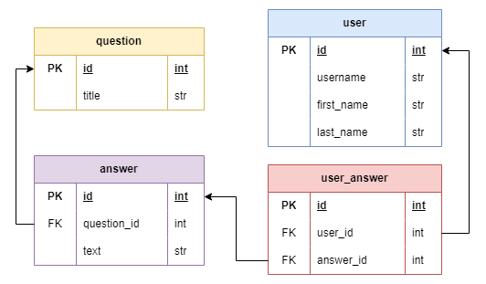

# Poll telegram bot

### About the project

This telegram bot can be used to conduct a poll.

The app uses a database. There are entities to be stored: User, Question, Answer.



### Usage

File `/resources/questions.json` contains the initial questions with answers. Questions from this file are inserted to the database when launch script 
```
python setup.py
```

To start the application you need to start `main.py`

```
python main.py
```

Please, make sure you have a proper `.env` in the project root directory before starting the application.